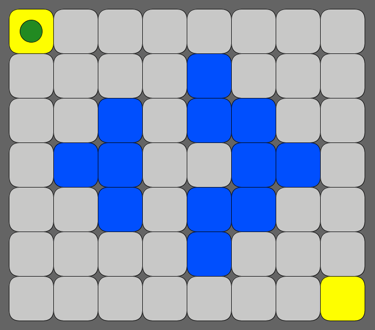
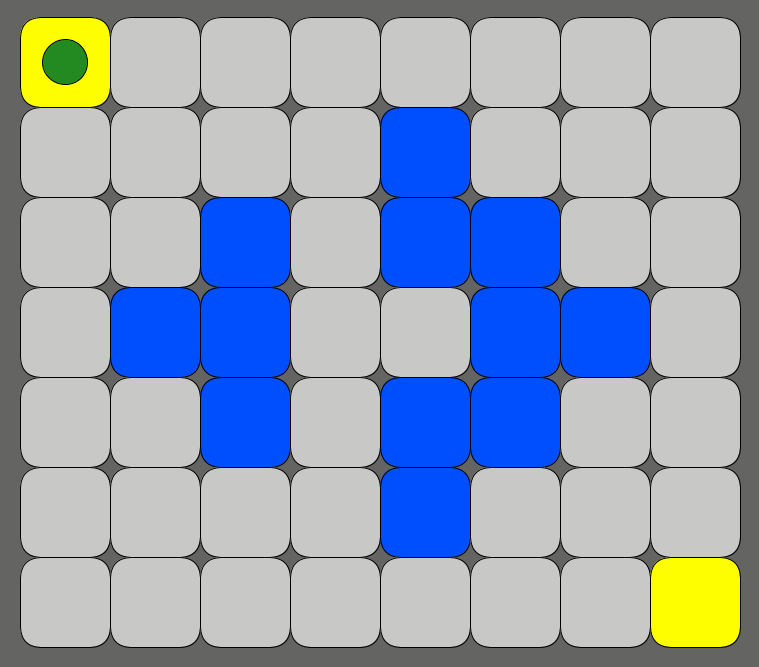
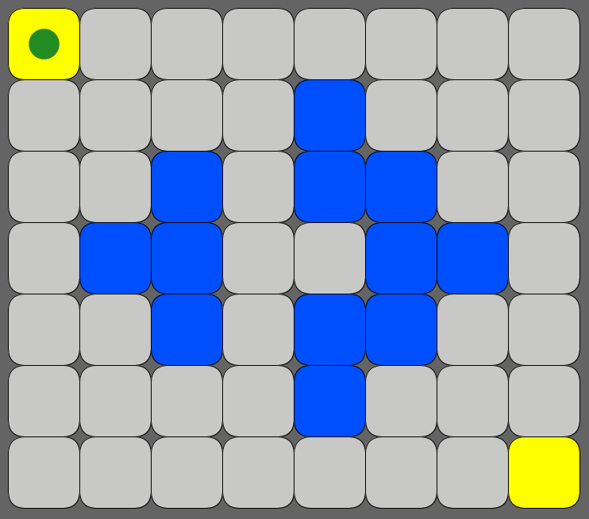
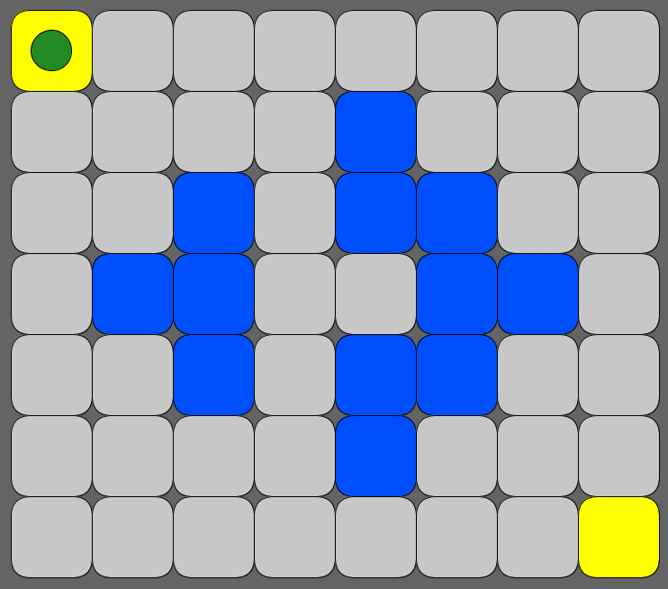
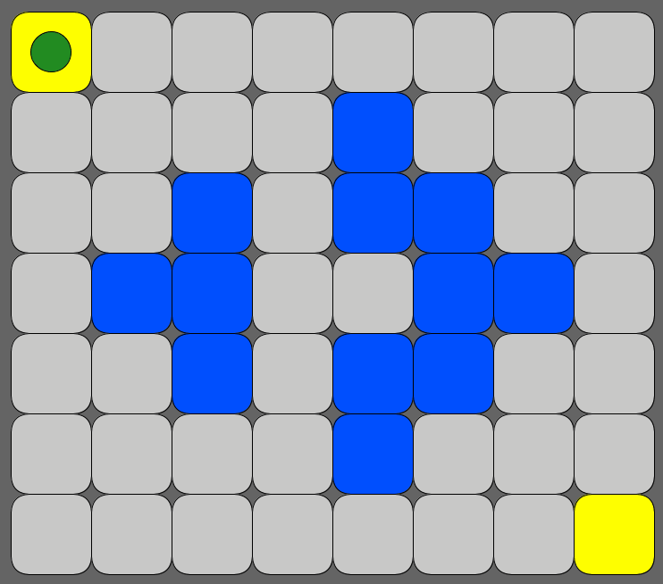

# ꡌ‍ Pathfinding com labirinto dinâmico: Autômatos Celulares + Árvores na prática! 🌳

No labirinto a seguir, é trivial sair do canto superior esquerdo e chegar no canto inferior direito:

  

Mas como você faria isso se o labirinto mudasse (deterministicamente) a cada movimento?

  

E em labirintos maiores? Têm como resolver com a menor quantidade possível de movimentos?

  

## O que isso tem haver com Autômatos Celulares e Árvores?

Bem, esse labirinto dinâmico é um **Autômato Celular** e o algoritmo que encontra o caminho até a saída utiliza como base uma **Árvore** para otimizar a busca da solução!

Se você reparar bem, todos os labirintos seguem as seguintes regras de mudança a cada movimento:

- As células cinza com 2 ou 3 vizinhos viram azúis na próxima geração.
- As células azúis com 4 ou 5 ou 6 vizinhos permanecem azúis. Do contrário, viram cinza.

Além disso, a própria busca pelo caminho é naturalmente modelada como uma árvore, onde cada movimento aumenta uma unidade na profundidade da mesma.

A seguir podemos ver a árvore sendo formada. Nela, cada bolinha verde é um nó folha que representa o final de um possível caminho até à saída do labirinto. Nós folha que não conseguem mais se expandir são podados da árvore, pois representam caminhos sem saída. Quando algum nó folha chega na saída, encontramos um caminho solução do labirinto.

  

## O projeto conta ainda com 3 modos de jogo:

### Fun

Você pode jogar manualmente usando o teclado (além de poder ativar/desativar a exibição de quantidade de vizinhos + hints de próximo estado):

  

### Debug

Você pode ver o algoritmo rodando passo a passo (controlando a execução via teclado). Bem útil para entender como o algoritmo funciona.

  

### Release

Para labirintos gigantes onde queremos apenas a solução final, sem ficar renderizando na tela cada movimento.

Gerei alguns tabuleiros com estado inicial aleatório (e tamanhos cada vez maiores) pra ver:

- Quantos movimentos são necessários para chegar na saída
- Quanto tempo leva pro algoritmo encontrar a solução

| Size          | Moves | Time    |
|---------------|-------|---------|
| 100 x 100     | 276   | 97 ms   |
| 500 x 500     | 1.376 | 4,1 s   |
| 1.000 x 1.000 | 2.776 | 34,2 s  |
| 1.500 x 1.500 | 4.174 | 2,5 min |
| 2.000 x 2.000 | 5.506 | 5,2 min |

O projeto conta ainda com mais de 80 casos de teste, pois utilizei o TDD durante grande parte da implementação:

  

Código completo no GitHub: https://github.com/ZaqueuCavalcante/mayz

> Encontrei esse problema em um desafio da Stone anos atrás, que foi coordenado pelo pessoal da Sigma Geek.
